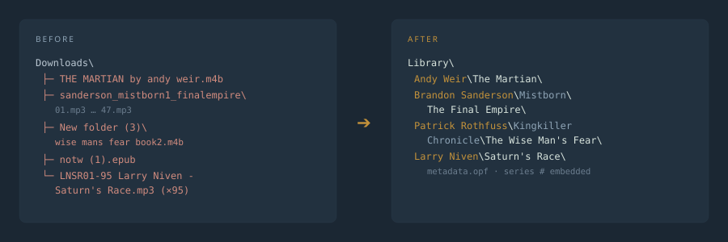
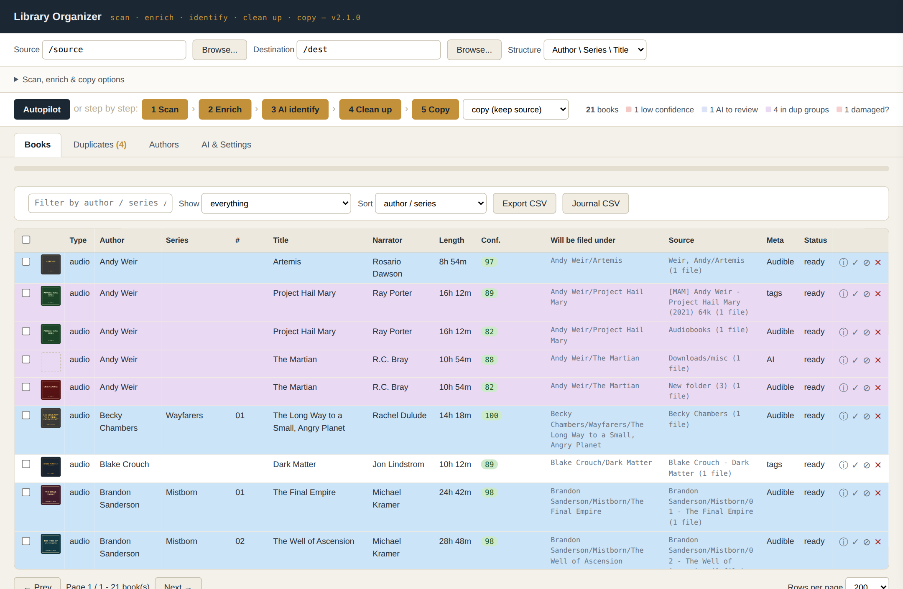
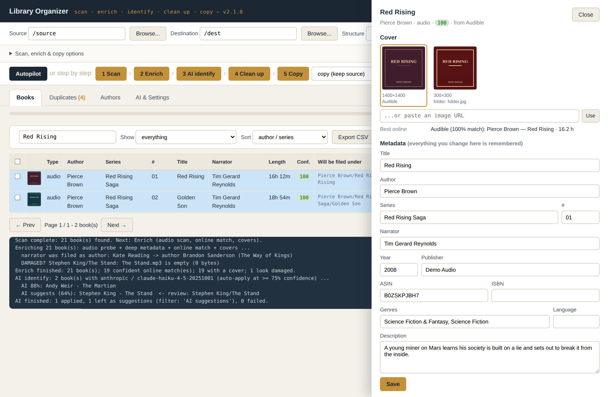
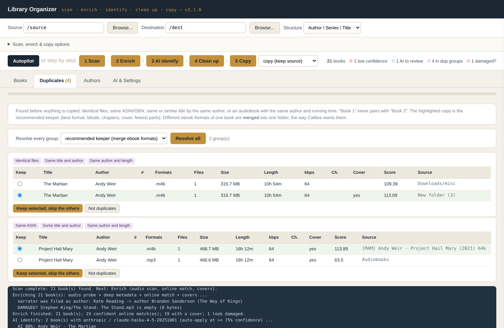
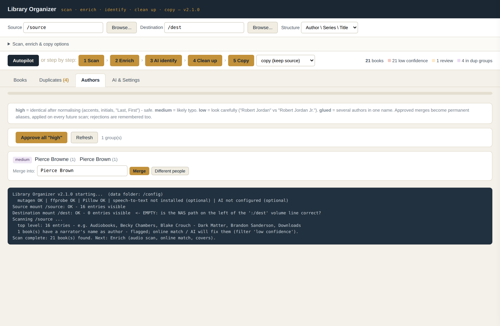
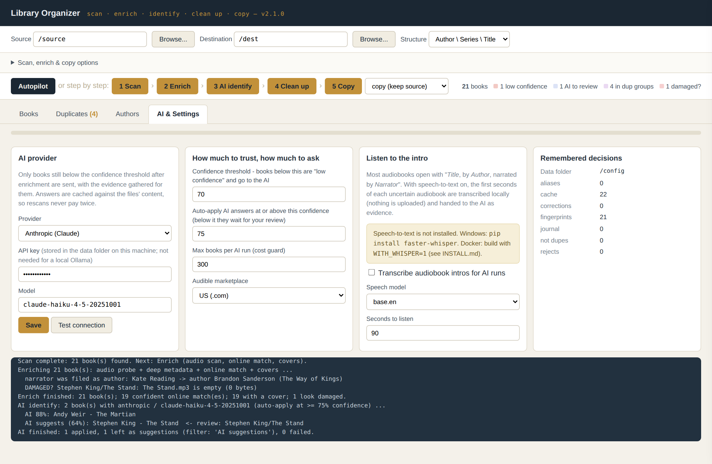

# Library Organizer

[](https://github.com/gmwestrup/Library-Organizer/actions/workflows/ci.yml)
[](https://github.com/gmwestrup/Library-Organizer/releases)
[](LICENSE)
[](requirements.txt)

[](docs/INSTALL.md)
[](windows/README.md)
[](https://www.audiobookshelf.org/)
[](https://calibre-ebook.com/)
[-D97757)](#optional-extras)
[](#how-it-works)

Point it at a messy folder of audiobooks and ebooks. It works out what every
book really is, finds the duplicates, fixes the author names, finds the best
covers, and **copies** everything into a clean library:

```
Author/
  Series/
    Title/
      the book files, cover.jpg, metadata.opf, metadata.json
```

That layout, with those files, is exactly what
[Audiobookshelf](https://www.audiobookshelf.org/) and
[Calibre](https://calibre-ebook.com/) want, so everything imports correctly
the first time. With **Copy** your originals are never changed, moved, or deleted; **Move** takes only the books you've approved.



## How it works

Press **Autopilot**, or run the steps yourself. Nothing is copied until you
press Copy.

| Step | What happens |
|---|---|
| **1 Scan** | Finds every book and names it from every clue it carries: sidecar `metadata.opf` / `metadata.json`, embedded tags, folder structure, file names. Strips torrent and encoder junk (`[MAM]`, `128k {465mb}`, `(Unabridged)`), joins disc and part folders into one book, and fixes Title/Author swaps using the authors the rest of your library already knows. |
| **2 Enrich** | Measures the audio (real length, bitrate, chapters; flags empty or unreadable files), reads narrator/year/ASIN/ISBN from the files, reads an ebook's title and copyright page for its ISBN, then matches online. For audiobooks the match is **length-aware**: the Audible edition whose runtime matches *your* file wins. Gathers every cover it can find and picks the best one. |
| **3 AI identify** | Optional. Only books still uncertain after step 2 are sent to Claude (or a local model like Ollama), with all the evidence. Can also *listen* to the first 90 seconds of an audiobook, where the narrator usually reads out the title and author. |
| **4 Clean up** | **Duplicates:** identical files (even renamed), same ASIN/ISBN, same or similar title, same author and running time. A recommended keeper is picked for you; epub + mobi + pdf of one book are merged into one folder. **Authors:** "King, Stephen" and "Stephen  King" are merged automatically; likely typos like "Stephen Kng" are grouped for a one-click merge. |
| **5 Copy / Move** | Copies into the clean structure and writes the reviewed metadata everywhere: `metadata.opf`, `metadata.json`, `cover.jpg`, and the tags and cover *inside* the copied audio files and epubs. Or **moves** only the books you've approved, so the source is left holding just the books that still need work. |

Every book gets a **confidence score** (0-100) from how well its sources
agree. Filter the table by *low confidence* to see exactly what needs your
eyes; everything else can go straight through.



## A quick tour

**Every book has a detail panel.** Pick a different cover from every
candidate found (embedded, folder image, Audible, Google, Open Library) or
paste an image URL; see the best online match and its runtime; edit any
field. Whatever you change is remembered.



**Duplicates are caught before they reach your server**, with the reason
for each match and a recommended keeper already selected: here a renamed
identical copy of *The Martian*, and a low-bitrate MP3 of *Project Hail
Mary* next to the better M4B.



**Author variants are grouped for one-click merging.** When the book counts
tie, the spelling most of your files' tags and folders use is suggested.



**AI & Settings**: choose Claude or a local model, how confident a book must
be before it's trusted, and whether to listen to audiobook intros.



*Screenshots use a small demo library with invented cover art.*

## Copy or move

**Copy** (the default) never touches your originals.

**Move approved books** takes only the books you're happy with out of the
source: those at or above your confidence threshold, or ones you've ticked
with **✓ Approve**. What's left in the source is exactly what still needs
work. Moves on the same drive are instant renames; across drives each file
is copied, verified, and only then deleted. If anything fails partway
through a book, its files are put back. In Docker, Move needs the source
mounted read-write (no `:ro`).

If a book is **already in the destination**, you choose: skip it, keep the
better copy, replace it (the old files are set aside in `.replaced`, not
deleted), or keep both.

## It remembers

Every edit you make, every author merge, every duplicate decision is stored
against the **content** of the files, in a small database in the data folder.
Rescan next month, rename the folders, add more messy downloads: your
decisions are re-applied automatically and only new questions are shown.

## What it catches

A few real examples it handles (the test suite has many more):

| Messy | Clean |
|---|---|
| `THE MARTIAN by andy weir.m4b` in `New folder (3)/` | Andy Weir / The Martian |
| `[MAM] Dean Koontz - Watchers (2021) 64k/` | Dean Koontz / Watchers |
| `Kate Reading - The Way of Kings/` (the *narrator* filed as author) | Brandon Sanderson / The Stormlight Archive / The Way of Kings, narrated by Kate Reading |
| `Dune - Frank Herbert.mobi` | Frank Herbert / Dune (merged with the epub) |
| `unsorted/book_00417.epub`, metadata says "Unknown" by "calibre" | ISBN found on its copyright page: Isaac Asimov / Foundation |
| `Weir, Andy/Project Hail Mary/` and `Audiobooks/Andy Weir - Project Hail Mary (Unabridged).mp3` | one book; the better copy is kept |
| `Neil Gaiman & Terry Pratchett` | author folder Neil Gaiman |
| a 0-byte `The Stand.mp3` | flagged *damaged* and held back |

And it knows when *not* to guess: a book called just `Home` with no other
evidence is never matched to a random book called *Home*.

## Two editions, one app

| | Windows | Docker / NAS |
|---|---|---|
| Runs | on your PC, opens in your browser (`127.0.0.1:8765`) | on your NAS, next to the files (`NAS-IP:8765`) |
| Setup | Python + `install-requirements.bat` | `docker compose up -d` |
| Best for | libraries on your PC or an attached drive | big libraries already on a NAS: copying runs at disk speed |

Both editions run the byte-identical application files. See
[`windows/README.md`](windows/README.md) and [`docs/INSTALL.md`](docs/INSTALL.md).

## Quick start

**Windows**
```
windows\install-requirements.bat
windows\LibraryOrganizer.pyw
```

**Docker / NAS** (edit the four volume paths first)
```
cd docker
sudo docker-compose -f docker-compose.build.yml up -d --build
```
Then open `http://<host>:8765`, pick the source and destination, and press
**Autopilot**.

## Optional extras

- **AI** (AI & Settings tab): an Anthropic API key (Claude Haiku is the
  default and costs very little per book), or any OpenAI-compatible endpoint:
  a local **Ollama** or LM Studio keeps everything on your network for free.
  Only uncertain books are sent, answers are cached, and a per-run cap
  guards the cost.
- **Listen to intros:** `pip install faster-whisper` (Windows) or build the
  Docker image with `WITH_WHISPER=1`. Runs locally on the CPU; no audio
  leaves your machine.
- **ffmpeg** gives the most accurate audio measurements. The Docker image
  includes it; on Windows it's optional.

## Where things are kept

| | Windows | Docker |
|---|---|---|
| Data folder | `%LOCALAPPDATA%\LibraryOrganizer` | `/config` volume |
| `organizer.db` | your remembered decisions, lookup cache, copy journal | |
| `organizer-plan.json` | the current review table (survives restarts) | |
| `settings.json` | AI settings, including your API key | |
| `covers/` | downloaded / extracted cover candidates | |

Back up the data folder along with your other configs. **Journal CSV**
(Books tab) exports every copy, skip and merge, source to destination.

## Tests

```
python tests/test_smoke.py            # edition parity + parser regressions
python tests/test_realworld_names.py  # real-world naming cases through the full scanner
python tests/test_pipeline.py         # the whole pipeline end to end (online + AI mocked)
python tests/test_move.py             # Move mode, rollback, "already in destination" options
```

## Credits

Library Organizer v2 folds in the author's earlier tools
[calibre-author-cleanup](https://github.com/gmwestrup/calibre-author-cleanup) and
[abs-duplicate-finder](https://github.com/gmwestrup/abs-duplicate-finder), adopts a
few ideas from [calibre-library-cleaner](https://github.com/gmwestrup/calibre-library-cleaner)
(which remains its own separate tool), and borrows ideas, word lists and real-world test cases from
[deucebucket/library-manager](https://github.com/deucebucket/library-manager)
(MIT). Metadata from Audible, [Audnexus](https://audnex.us), Google Books and
Open Library. See [`NOTICE.md`](NOTICE.md).

## License

MIT, see [LICENSE](LICENSE). Audio tagging uses
[mutagen](https://github.com/quodlibet/mutagen) (GPL-2.0), installed as a
separate dependency; see `NOTICE.md` for what that means for redistribution.
